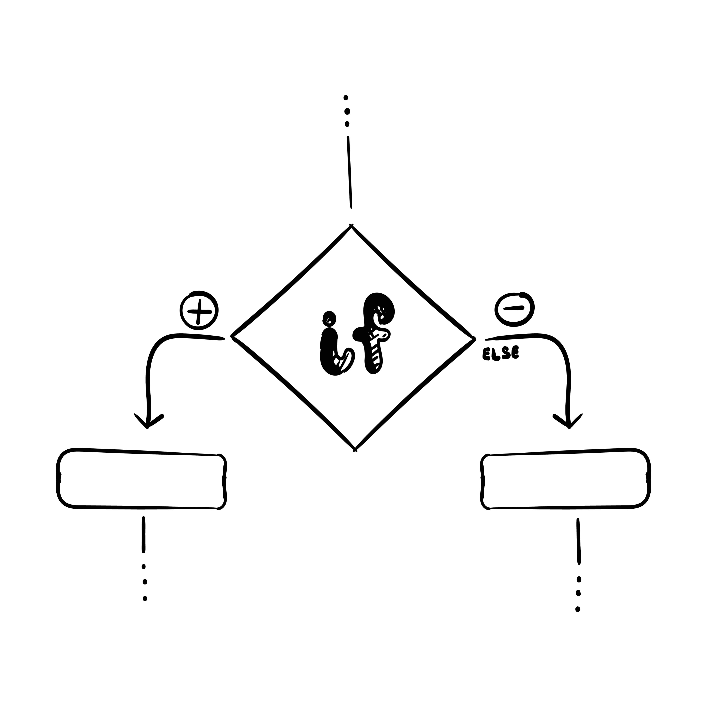
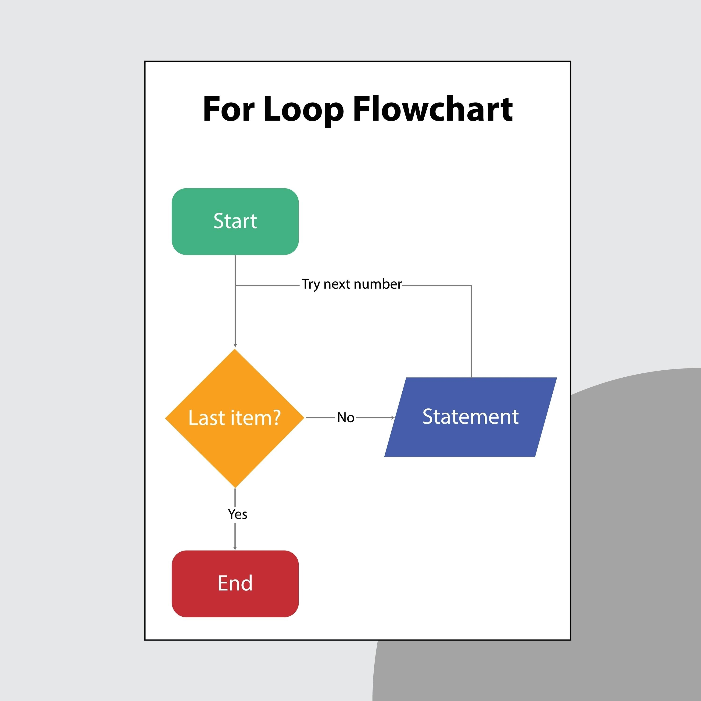

# Sraxdgd

### Phase 1

Environment Setup: Installing Python and a code editor (like VS Code or Thonny).

The Print Function: Your first print("Hello World") moment.

Variables & Data Types: Storing information as Strings, Integers, Floats, and Booleans.

Basic Math & Operators: Using +, -, *, /, and %.

User Input: Using input() to make the program interactive.

Comments: Learning to use # to explain what the code is doing.

Conditionals: Making decisions with if, elif, and else.

Explore
Comparison & Logical Operators: Using ==, !=, and, and or.

Lists: Storing multiple items in one place and accessing them by index.

For Loops: Iterating over lists or ranges of numbers.

Explore
While Loops: Running code as long as a certain condition remains true.

Functions: Grouping code into reusable blocks with def.

Dictionaries: Storing data in "Key: Value" pairs (like a real dictionary).

Modules: Using import to bring in outside tools (like random or time).

Error Handling: Using try and except to prevent crashes.

File Handling: Learning how to open, read, and write to .txt files.